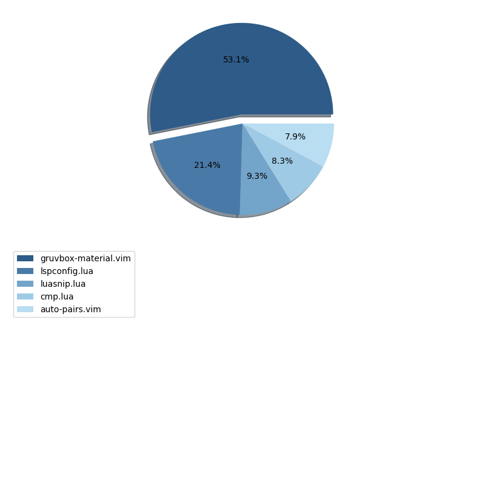

<br/>
<p align="center">
  <h3 align="center">Neovim plugin analyzer</h3>

  <p align="center">
    check if your plugins are blazingly fast!
    <br/>
    <br/>
  </p>
</p>


## Table Of Contents

* [About the Project](#about-the-project)
* [Built With](#built-with)
* [Getting Started](#getting-started)
* [Prerequisites](#prerequisites)
* [Installation](#installation)
* [Usage](#usage)
* [Contributing](#contributing)
* [Authors](#authors)
* [Acknowledgements](#acknowledgements)

## About The Project



In the realm of modern development, having a finely tuned text editor is a must. Neovim, a popular and extensible text editor, has gained a significant following for its powerful capabilities and flexibility. Central to Neovim's allure are its plugins, which enable users to enhance their editing environment with an array of functionalities. However, as the roster of installed plugins expands, so can the issue of slower loading times during startup. In this project, we delve into the intriguing task of analyzing Neovim plugin loading times using Python.

## Built With

This was built using bash 5.12 and python 3.11.2 for packer my favorite plugin manager for neovim 


### Prerequisites

This is an example of how to list things you need to use the software and how to install them.

* python

```sh
pip install pandas matplotlib seaborn
```

### Installation

1. Clone the repo

```sh
git clone https://github.com/AnupPainuly/neovim-startup-analysis.git
```

2. Install python packages

```sh
pip install
```

## Usage

after you have cloned this repository you can run the `build.sh` script to create the logs to further clean and analyze them by calling the python script. You can make the necessary changes to the script according to your directory structure of your favourite plugin manager.

## Contributing

Contributions are what make the open source community such an amazing place to be learn, inspire, and create. Any contributions you make are **greatly appreciated**.
* If you have suggestions for adding or removing pertaining to project, feel free to [open an issue](https://github.com/AnupPainuly/neovim-startup-analysis/issues/new) to discuss it, or directly create a pull request after you edit the *README.md* file with necessary changes.
* Please make sure you check your spelling and grammar.
* Create individual PR for each suggestion.

### Creating A Pull Request

1. Fork the Project
2. Create your Feature Branch 
```shell
git checkout -b feature/AmazingFeature
```
3. Commit your Changes 
```shell
git commit -m 'Add some AmazingFeature'
```
4. Push to the Branch 
```shell
git push origin feature/AmazingFeature
```
5. Open a Pull Request

## License

Distributed under the MIT License. See [LICENSE](https://github.com/AnupPainuly/neovim-startup-analysis/blob/main/LICENSE.md) for more information.
